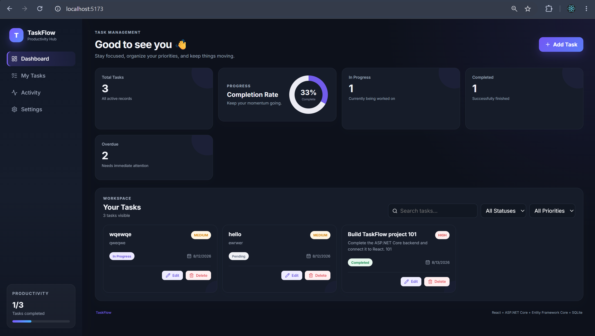
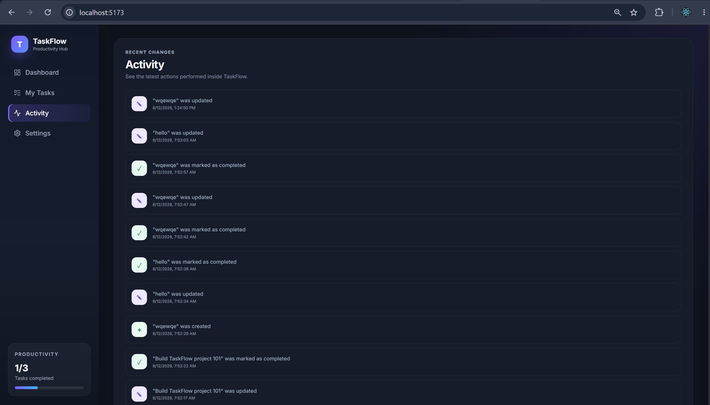
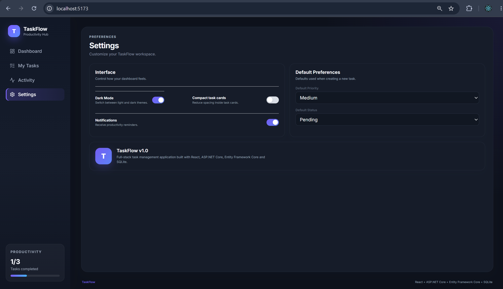

<div align="center">

# ⚡ TaskFlow

### A modern full-stack productivity & task management application

Built with **React • ASP.NET Core • Entity Framework Core • SQLite**

<br />


<br />

A responsive task-management dashboard for organizing work, tracking
progress, managing priorities, and maintaining a persistent activity history.

</div>

---

## 📸 Application Preview

### 🏠 Dashboard

<p align="center">
  
</p>

The dashboard provides an overview of tasks, completion statistics, overdue
work, search and filtering, and a visual completion-rate indicator.

### 📋 Activity Tracking

<p align="center">
  
</p>

TaskFlow maintains a persistent history of task creation, updates,
completion, and deletion using the ASP.NET Core API and SQLite database.

### 🌙 Dark Mode

<p align="center">
  
</p>

The interface includes a persistent dark theme preference stored using
browser local storage.

---

## ✨ Features

| Feature | Description |
|---|---|
| ➕ **Task Creation** | Create tasks with title, description, priority, status and due date |
| ✏️ **Task Editing** | Modify existing task information |
| 🗑️ **Task Deletion** | Delete tasks with confirmation |
| 🔎 **Search** | Search tasks by title and description |
| 🎯 **Filtering** | Filter by status and priority |
| 📊 **Dashboard Analytics** | View total, active, completed and overdue tasks |
| 🍩 **Completion Tracking** | Dynamic completion-rate visualization |
| 🕒 **Activity History** | Persistent audit-style activity tracking |
| 🌙 **Dark Mode** | Persistent light/dark appearance preference |
| 🔔 **Toast Notifications** | Visual feedback for CRUD operations |
| 📱 **Responsive UI** | Interface adapts across screen sizes |
| 💾 **Persistence** | Tasks and activity stored in SQLite |

---

## 🛠️ Technology Stack

### Frontend

| Technology | Purpose |
|---|---|
| React.js | Component-based user interface |
| JavaScript | Frontend application logic |
| Vite | Development and build tooling |
| HTML5 / CSS3 | Structure and responsive styling |
| Lucide React | UI icon library |
| React Hot Toast | User notifications |

### Backend

| Technology | Purpose |
|---|---|
| C# | Backend programming language |
| .NET 9 | Application platform |
| ASP.NET Core Web API | REST API |
| Entity Framework Core | Object-relational mapping |
| SQLite | Relational database |

### Development

`Git` • `GitHub` • `Visual Studio Code` • `npm` • `.NET CLI` • `REST Client`

---

## 🏗️ Architecture

```text
                    ┌─────────────────────────┐
                    │      React Frontend     │
                    │       Vite + JSX        │
                    └────────────┬────────────┘
                                 │
                                 │ HTTP / REST
                                 │ JSON
                                 ▼
                    ┌─────────────────────────┐
                    │   ASP.NET Core Web API  │
                    │     C# Controllers      │
                    └────────────┬────────────┘
                                 │
                                 │ Entity Framework Core
                                 ▼
                    ┌─────────────────────────┐
                    │         SQLite          │
                    │    Relational Database  │
                    └─────────────────────────┘
```

The frontend and backend are separated into independent application layers.

React handles presentation and client-side state, while ASP.NET Core exposes
REST endpoints responsible for application data. Entity Framework Core acts
as the ORM between the API and SQLite.

---

## 🔄 How a Request Flows Through TaskFlow

For example, when a user creates a task:

```text
User
 │
 ▼
React Task Form
 │
 │ POST /api/tasks
 │ JSON
 ▼
ASP.NET Core Controller
 │
 ▼
Entity Framework Core
 │
 ▼
SQLite Database
 │
 ▼
API Response
 │
 ▼
React UI Updates
 │
 ▼
Success Toast
```

This demonstrates the complete request lifecycle between the frontend,
REST API, ORM and relational database.

---

## 🌐 REST API

### Task Endpoints

| Method | Endpoint | Description |
|---|---|---|
| `GET` | `/api/tasks` | Retrieve all tasks |
| `GET` | `/api/tasks/{id}` | Retrieve a task by ID |
| `POST` | `/api/tasks` | Create a new task |
| `PUT` | `/api/tasks/{id}` | Update an existing task |
| `DELETE` | `/api/tasks/{id}` | Delete a task |

### Activity Endpoints

| Method | Endpoint | Description |
|---|---|---|
| `GET` | `/api/activity` | Retrieve recent activity |
| `POST` | `/api/activity` | Create an activity record |

---

## 🧩 Project Structure

```text
Taskflow/
│
├── Taskflow.api/
│   ├── Controllers/
│   │   ├── TasksController.cs
│   │   └── ActivityController.cs
│   │
│   ├── Data/
│   │   └── TaskDbContext.cs
│   │
│   ├── Models/
│   │   ├── TaskItem.cs
│   │   └── ActivityLog.cs
│   │
│   ├── Migrations/
│   ├── Properties/
│   ├── Program.cs
│   ├── appsettings.json
│   └── Taskflow.api.csproj
│
├── taskflow-ui/
│   ├── src/
│   │   ├── components/
│   │   │   ├── ActivityView.jsx
│   │   │   ├── CompletionChart.jsx
│   │   │   ├── SettingsView.jsx
│   │   │   ├── StatsCard.jsx
│   │   │   ├── TaskCard.jsx
│   │   │   ├── TaskForm.jsx
│   │   │   └── TasksView.jsx
│   │   │
│   │   ├── services/
│   │   │   └── taskService.js
│   │   │
│   │   ├── App.jsx
│   │   └── App.css
│   │
│   └── package.json
│
├── screenshots/
│   ├── dashboard.png
│   ├── activity.png
│   └── dark-mode.png
│
├── .gitignore
└── README.md
```

---

## 🚀 Getting Started

### Prerequisites

Make sure you have installed:

- .NET SDK
- Node.js
- npm
- Git

### 1. Clone the repository

```bash
git clone https://github.com/Ibaad-AhmedAjaz/TaskFlow.git
cd TaskFlow
```

### 2. Start the ASP.NET Core API

```bash
cd Taskflow.api
dotnet restore
dotnet ef database update
dotnet run
```

The development API is configured to run locally on:

```text
http://localhost:5023
```

### 3. Start the React application

Open another terminal:

```bash
cd taskflow-ui
npm install
npm run dev
```

Then open:

```text
http://localhost:5173
```

---

## 🧠 Concepts Demonstrated

This project demonstrates practical usage of:

- Object-Oriented Programming with C#
- ASP.NET Core Web API development
- RESTful API design
- CRUD operations
- Dependency Injection
- Entity Framework Core
- ORM-based database access
- EF Core migrations
- Relational data persistence
- Asynchronous programming with `async` / `await`
- React components
- React hooks and state management
- Frontend/backend API integration
- Search and filtering
- CORS configuration
- Responsive UI design
- Persistent UI preferences
- Error handling and user feedback

---

## 💡 Why TaskFlow?

TaskFlow was built as a hands-on full-stack project to strengthen practical
experience with **C#, ASP.NET Core, REST APIs, Entity Framework Core,
relational databases and React.js**.

The project focuses on understanding the complete application lifecycle —
from a user interaction in React, through an HTTP request to ASP.NET Core,
to persistent storage using Entity Framework Core and SQLite.

---

## 🔮 Future Enhancements

- 🔐 Authentication and authorization
- 👤 User-specific task workspaces
- 🏷️ Categories and tags
- 🖱️ Drag-and-drop task organization
- 🔔 Due-date reminders
- 📄 Pagination
- 🧪 Unit and integration testing
- 🗄️ SQL Server support
- ☁️ Cloud deployment

---

<div align="center">

## 👨‍💻 Author

**Ibaad Ahmed Ajaz**

[](https://github.com/Ibaad-AhmedAjaz)

[](https://www.linkedin.com/in/ibaadahmed077)

<br />

**TaskFlow — React × ASP.NET Core**

</div>